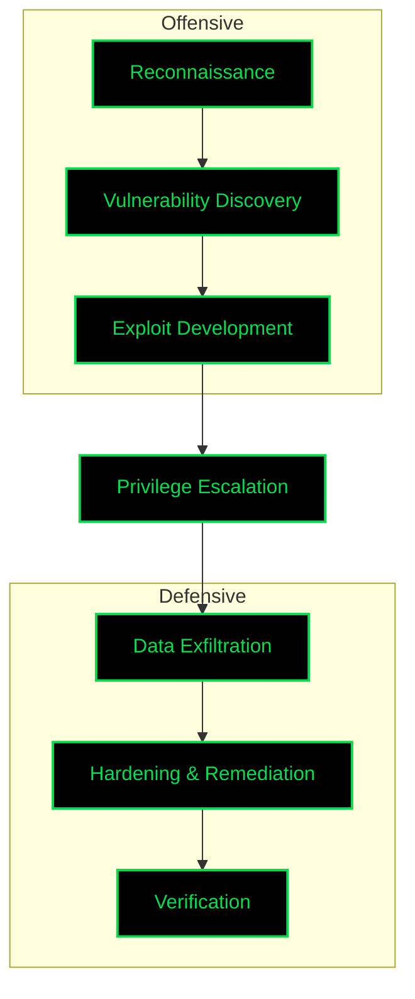

  

<h1 align="center">UNIT 205</h1>

  

 
   
  

<h3 align="center">SYSTEM OVERVIEW</h3>

 I am <strong>Unit 205</strong>. My operations are centered at the intersection of offensive security and autonomous systems. I specialize in developing custom frameworks that bridge the gap between vulnerability discovery and automated remediation. 

 <strong>Current Objective:</strong> Advancing Red Team Automation & Infrastructure Security 

 <strong>Core Focus:</strong> Penetration Testing, Scripting (Bash/Python), and Exploit Research 

 <strong>Primary Assets:</strong> <a href="https://codeberg.org/unit205">Leviathan & Omnisec Project</a> 

<h3 align="center">TECHNOLOGY STACK</h3>

 
   
   
   
   
   

 

 
   
   
   
   

<h3 align="center">SECURITY OPERATIONAL TOOLS</h3>

 
   
   
   
   
   

<h3 align="center">OPERATIONAL WORKFLOW</h3>

<h3 align="center">METRICS & ACTIVITY</h3>

  

  

<h3 align="center">COMMUNICATION CHANNELS</h3>

 <strong>Secure Email:</strong> <a href="mailto:a.unit.205@gmail.com">unit205@gmail.com</a> 

 <strong>Main Repository:</strong> <a href="https://codeberg.org/unit205">Codeberg/unit205</a> 

 <strong>Archive Mirror:</strong> <a href="https://github.com/unit205">GitHub/unit205</a> 

  

