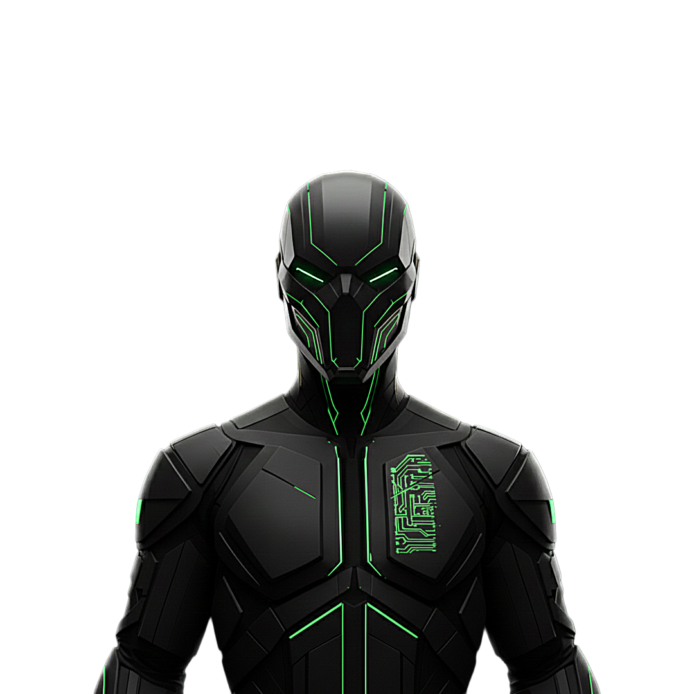

  

<h1 align="center">UNIT 205</h1>

  

 
   
  

<h3 align="center">SYSTEM OVERVIEW</h3>

 I am <strong>Unit 205</strong>. My operations are centered at the intersection of offensive security and autonomous systems. I specialize in developing custom frameworks that bridge the gap between vulnerability discovery and automated remediation. 

 <strong>Current Objective:</strong> Advancing Red Team Automation & Infrastructure Security 

 <strong>Core Focus:</strong> Penetration Testing, Scripting (Bash/Python), and Exploit Research 

 <strong>Primary Assets:</strong> <a href="https://github.com/unit205">GITHUB</a> | <a href="https://codeberg.org/unit205">CODEBERG</a> 

<h3 align="center">TECHNOLOGY STACK</h3>

      
 
      

<h3 align="center">SECURITY OPERATIONAL TOOLS</h3>

      

<h3 align="center">ACTIVITY AND ENGAGEMENT</h3>

  

<h3 align="center">COMMUNICATION CHANNELS</h3>

 <strong>Email:</strong> <a href="mailto:a.unit.205@gmail.com">unit205@gmail.com</a> 

 <strong>Codeberg:</strong> <a href="https://codeberg.org/unit205">unit205</a> 

 <strong>Owner:</strong> <a href="https://github.com/funbinet">Funbinet</a> 

  

